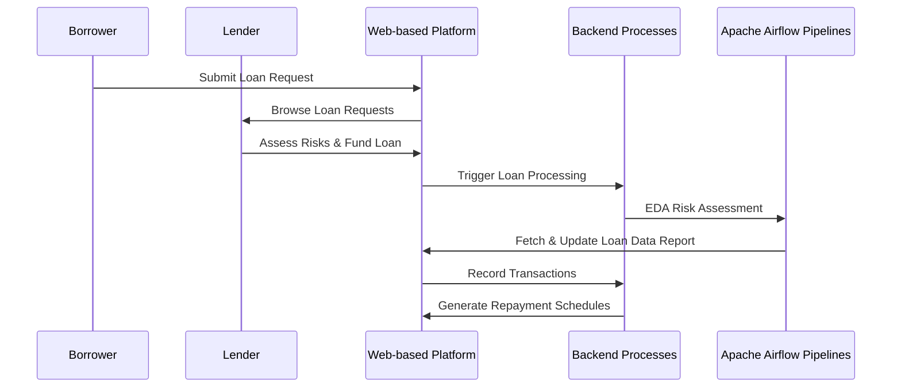
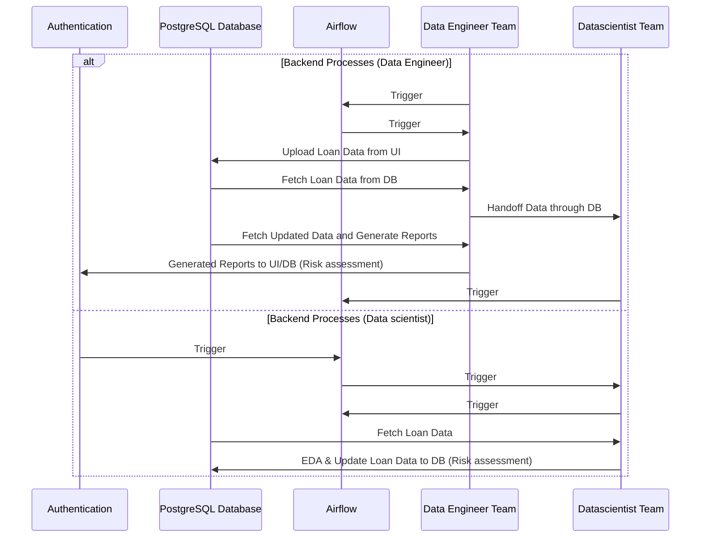

## [Peer to Peer] Lending Platform

1. Objective
- Create a system for a Peer-to-Peer(P2P) lending platform that connects borrowers with individual lenders.
  - WHY P2P?
    - According to [Forecast](https://www.linkedin.com/pulse/p2p-lending-market-growth-trends-forecast-yrygf/):P2P lending is a significant and growing segment in FinTech, addressing real-world financial needs.P2P Lending Market size is projected to reach Multimillion USD by 2029, In comparison to 2022, at unexpected CAGR during 2022-2029.
    - Designing a P2P lending platform allows me to demonstrate my understanding of the entire system architecture, from user interactions on the front end to backend data processing and storage.
    - Also, wanted to make alternative insurance withdrawing.. but couldnt find relevant good data online
    - Recommended relational database options: MySQL, PostgreSQL, or Oracle Database: These are reliable choices with good ACID compliance, suitable for scenarios where transactions and data consistency are critical.
  
------
2. UI(User Flow Chart)
    - Borrowers submit loan requests, providing personal and financial details.
    - Lenders browse loan requests, assess risks, and decide to fund loans.
    - System calculates interest rates based on risk assessments.
    - Once funded, transactions are recorded, and repayment schedules are generated

--------
3. Backend Services
   - System Design Details
     - Authentication: Use Python-based authentication systems.
     - Risk Assessment: Implement machine learning models to assess borrower risks.
     - Transaction Processing: Utilize SQL for recording transactions securely.
     - Apache Airflow Pipelines:
       - Schedule daily pipelines to fetch and update loan data.
       - Generate reports on loan performance, default rates, and investor returns.
- _Note: connections involving authentication, risk assessment, SQL operations, and Apache Airflow Pipelines are in straight arrows. Connections involving the backend processes (backend) and reports are in dotted arrows_

-----------
  4.  Implementation
     - Data Generation: [Dataset](https://www.kaggle.com/datasets/sid321axn/bondora-peer-to-peer-lending-loan-data) 
       - Created Python scripts to generate dummy data for users
       - Used SQL to populate the database with this dummy data.
     - Airflow Pipelines:(Refer to dags folder[main.py and report.py])
       - Defined tasks to fetch and upload data from and to the database.
       - Data enginnnnering team will collect data from UI and transfer to Database where Data scientists will fetch uploaded data to preporcess and do analysis like risk asessment and create interest rates as needed for reporting.
       - The updated data by datascientists will be uploaded to database update table and data engineer pipeline will fetch and generate and store reports in a dedicated location(either to UI for  stakehoders view).

-----------
--------
### BONUS CHALLENGE
##### Question:
Consider a game in which each participants enters a whole number between
zero and one hundred. The winner is the one who chooses the number, rounding
down, nearest to half the average guess of the other participants.
- What is your strategy?
- What number would you choose? and why?

##### Answer:
 1. Strategy
   - Participants might use a variety of strategies to guess the average.
   - One approach is to assume that participants will have a tendency to guess around the middle (50) and strategically choose a number slightly lower.
 2. Number Choice
   - Considering others might choose 50, So i will strategically choose a number like 25.
   - The reasoning is that by choosing a lower number, I position myself closer to the lower end of the guesses, increasing my chances of rounding down to the correct half.
 3. Why?
   - This strategy is based on the assumption that many participants will choose a number around the middle, and by choosing a lower number, it increases my chances of being closest to half the average.
 4. Formula (refer to bonus.ipynb file)
   - Assuming 5 partcipants and randomly put numbers like[50,60,75,55,25]

- Participant’s Guess = 1/2 × (Assumed Middle - Deviation)

    - The **Assumed Middle** is the expected average guess of other participants, often assumed to be around 26.5.
    - The **Mean Deviation** is the participant's strategic decision to position slightly lower than the assumed middle.
    - The formula calculates the participant's guess as half the difference between the assumed middle and the chosen deviation.
    

------
------

** Thank you

